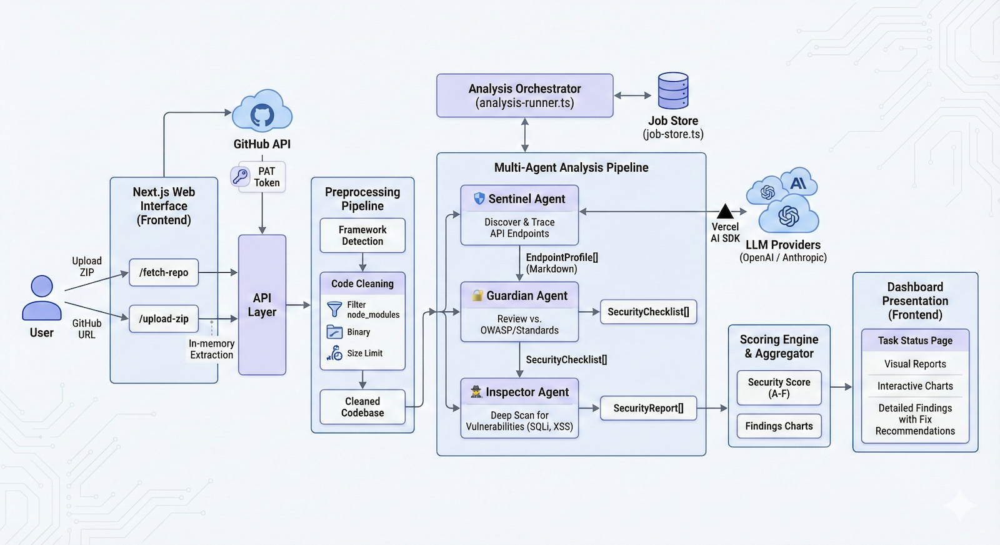

# Code Scanner AI 🛡️

An intelligent security analysis tool that uses a multi-agent AI system to scan codebases for security vulnerabilities, missing controls, and best practice violations.

[](https://github.com/kavienanj/code-scanner-ai)


## 🎬 Demo

Watch the demo video: [Code Scanner AI Demo](https://drive.google.com/file/d/1hTy0q5TNar47Au9ziIetiwR45TxnLEWV/view?usp=sharing)



## Features

- 🔍 **Multi-Agent Analysis** - Three specialized AI agents work together to provide comprehensive security analysis
- 📊 **Visual Reports** - Interactive dashboard with security scores, charts, and detailed findings
- 🚀 **Multiple Upload Methods** - Support for ZIP uploads and GitHub repository URLs
- 🎯 **Framework Detection** - Automatic detection of project frameworks with specialized analysis
- 📝 **Real-time Logs** - Live streaming logs during analysis
- 🔐 **OWASP Mapped** - Findings mapped to OWASP Top 10 and API Security standards

## Table of Contents

- [Getting Started](#getting-started)
  - [Prerequisites](#prerequisites)
  - [Installation](#installation)
  - [Environment Setup](#environment-setup)
  - [Running the Application](#running-the-application)
    - [Development Mode](#development-mode)
    - [Docker Deployment](#docker-deployment)
- [Upload Methods](#upload-methods)
- [Preprocessing](#preprocessing)
- [Analysis Agents](#analysis-agents)
- [Output & Reports](#output--reports)
- [Configuration](#configuration)
- [Maintainer](#maintainer)

## Getting Started

### Prerequisites

- Node.js 18+ (for local development)
- pnpm (recommended) or npm (for local development)
- OpenAI API key or Anthropic API key
- **Docker & Docker Compose (optional, for containerized deployment)**

### Installation

```bash
# Clone the repository
git clone https://github.com/kavienanj/code-scanner-ai.git
cd code-scanner-ai

# Install dependencies
pnpm install

# Copy environment variables
cp .env.example .env
```

### Environment Setup

Edit `.env` with your API keys:

```env
# AI Model Configuration
DEFAULT_MODEL=claude-opus-4-5-20251101

# API Keys (at least one required)
OPENAI_API_KEY=sk-your-openai-key
ANTHROPIC_API_KEY=sk-ant-your-anthropic-key
```

### Running the Application

#### Development Mode

```bash
# Development mode
pnpm dev

# Production build
pnpm build
pnpm start
```

Visit `http://localhost:3000` to access the application.

#### Docker Deployment

**Using Docker Compose (Recommended)**

The easiest way to run the entire application with both frontend and API services:

```bash
# Ensure .env file is configured with your API keys
cp .env.example .env
# Edit .env with your actual API keys

# Build and start all services
docker-compose up --build

# Or run in background
docker-compose up --build -d

# View logs
docker-compose logs -f

# Stop all services
docker-compose down
```

This will start:
- Frontend on `http://localhost:3000`
- API on `http://localhost:3001`

**Building Individual Docker Images**

Build and run API service separately:

```bash
# Build API image
docker build -f Dockerfile.api -t code-scanner-api \
  --build-arg DEFAULT_MODEL=gpt-4.1-nano-2025-04-14 \
  --build-arg NEXT_PUBLIC_FRONTEND_URL=http://localhost:3000 .

# Run API container
docker run -p 3001:3000 \
  -e OPENAI_API_KEY=your-key-here \
  -e ANTHROPIC_API_KEY=your-key-here \
  code-scanner-api
```

Build and run frontend service separately:

```bash
# Build frontend image
docker build -f Dockerfile.frontend -t code-scanner-frontend \
  --build-arg NEXT_PUBLIC_API_URL=http://localhost:3001 .

# Run frontend container
docker run -p 3000:3000 code-scanner-frontend
```

**Docker Configuration**

Environment variables can be configured in `.env` file:

```env
# AI Model Configuration
DEFAULT_MODEL=gpt-4.1-nano-2025-04-14

# API Keys (passed only at runtime, not baked into images)
OPENAI_API_KEY=sk-your-openai-key
ANTHROPIC_API_KEY=sk-ant-your-anthropic-key

# Frontend URL for CORS (production only)
NEXT_PUBLIC_FRONTEND_URL=https://your-frontend-domain.com
```

**Security Notes:**
- API keys are only passed at runtime via environment variables
- Sensitive credentials are never baked into Docker images
- All containers run as non-root users
- Multi-stage builds minimize image size and attack surface

---

## Upload Methods

Code Scanner AI supports two methods for uploading code:

### 1. ZIP File Upload

Upload a ZIP archive containing your project source code directly through the web interface.

- **Supported**: Any ZIP file up to 50MB
- **Best for**: Local projects, offline analysis
- **Process**: File is extracted in-memory and processed immediately

### 2. GitHub Repository URL

Provide a GitHub repository URL to fetch and analyze the codebase.

- **Supported**: Public repositories (private repos with pat token)
- **Format**: `https://github.com/owner/repo` or `https://github.com/owner/repo/tree/branch`
- **Best for**: Open source projects, quick scans

---

## Preprocessing

Before analysis begins, the uploaded code goes through a preprocessing pipeline:

### Framework Detection

The system automatically detects the project framework based on:

- Package manager files (`package.json`, `requirements.txt`, `pom.xml`, etc.)
- Configuration files (framework-specific configs)
- File structure patterns
- Import statements and dependencies

**Supported Frameworks:**
- JavaScript/TypeScript: Next.js, Express, NestJS, Fastify
- Python: Django, Flask, FastAPI
- Java: Spring Boot
- And more...

### Code Cleaning

Files are filtered and cleaned based on the detected framework:

1. **Directory Filtering** - Removes irrelevant directories:
   - `node_modules/`, `.git/`, `dist/`, `build/`
   - Virtual environments, cache directories
   - Test fixtures and mock data

2. **File Filtering** - Includes only relevant source files:
   - Source code files (`.ts`, `.js`, `.py`, `.java`, etc.)
   - Configuration files (framework-specific)
   - Excludes minified files, lock files, binary files

3. **Size Limits** - Files over 1MB are excluded to optimize analysis

---

## Analysis Agents

The security analysis is performed by three specialized AI agents working in sequence:

### 🛡️ Sentinel Agent

**Task: Endpoint Discovery & Code Tracing**

The Sentinel Agent is responsible for discovering API endpoints and tracing their complete code flow.

**What it does:**
- Scans the codebase for API entry points (routes, controllers, handlers)
- Traces each endpoint through the code following imports and function calls
- Documents middleware chains, validators, and database interactions
- Generates detailed markdown documentation for each endpoint flow
- Groups related CRUD operations for the same entity

**Output:** `EndpointProfile[]` - Detailed profiles of each discovered endpoint including:
- Flow name and purpose
- Entry point location
- Input/output types
- Sensitivity level assessment
- Complete code documentation in markdown

### 🔐 Guardian Agent

**Task: Security Checklist Generation**

The Guardian Agent analyzes each discovered endpoint and generates a tailored security checklist.

**What it does:**
- Reviews endpoint profiles from Sentinel
- Consults OWASP Top 10, API Security guidelines, and framework best practices
- Generates required and recommended security controls
- Assigns importance levels (critical, high, medium, low)
- Maps controls to OWASP categories

**Output:** `SecurityChecklist[]` - Security checklists for each flow including:
- Required controls (must-have for security)
- Recommended controls (best practices)
- Security references and documentation links
- OWASP mappings for each control

### 🕵️ Inspector Agent

**Task: Code Inspection & Vulnerability Detection**

The Inspector Agent performs deep code inspection against the security checklists.

**What it does:**
- Matches code implementations against security checklists
- Identifies implemented, missing, and framework-handled controls
- **Actively scans for vulnerabilities:**
  - SQL Injection
  - Cross-Site Scripting (XSS)
  - Command Injection
  - Path Traversal
  - Hardcoded Secrets
  - SSRF, Weak Cryptography, and more
- Provides specific code locations and fix recommendations

**Output:** `SecurityReport[]` - Detailed security reports including:
- Implemented controls with evidence
- Missing controls with recommendations
- Auto-handled controls (framework protections)
- Detected vulnerabilities with severity ratings
- Overall security severity assessment

---

## Output & Reports

### Security Score

A calculated score from 0-100 based on:

| Factor | Impact |
|--------|--------|
| **Vulnerabilities** | -15 (critical), -10 (high), -5 (medium), -2 (low) |
| **Missing Controls** | -8 (critical), -5 (high), -3 (medium), -1 (low) |
| **Implementation Bonus** | +10 (>80%), +5 (>60%), +2 (>40% implemented) |

**Grades:**
- **A (90-100)**: Excellent security posture
- **B (80-89)**: Good, minor improvements needed
- **C (70-79)**: Fair, address medium-priority issues
- **D (60-69)**: Poor, significant gaps exist
- **F (0-59)**: Critical, immediate action required

### Findings Distribution Chart

Visual pie chart showing:
- ✅ Implemented controls (green)
- ⚠️ Missing controls (orange)
- 🔵 Auto-handled by framework (blue)
- 🔴 Vulnerabilities found (red)

### Detailed Reports

Each endpoint receives a detailed security report with:
- Endpoint details and sensitivity level
- Checklist verification results
- Vulnerability findings with code snippets
- Actionable recommendations

### Debug Output

Raw analysis outputs are saved to `/output/` for debugging:
- `sentinel-agent/` - Endpoint discovery logs
- `guardian-agent/` - Checklist generation logs
- `inspector-agent/` - Inspection results

---

## Configuration

### Environment Variables

| Variable | Description | Required | Default |
|----------|-------------|----------|---------|
| `DEFAULT_MODEL` | AI model to use | Yes | `gpt-4.1-nano-2025-04-14` |
| `OPENAI_API_KEY` | OpenAI API key | If using GPT models | - |
| `ANTHROPIC_API_KEY` | Anthropic API key | If using Claude models | - |
| `NEXT_PUBLIC_API_URL` | API URL for frontend (build-time) | No | `http://localhost:3001` |
| `NEXT_PUBLIC_FRONTEND_URL` | Frontend URL for CORS | No | `http://localhost:3000` |

**Configuration Methods:**
- **Development**: Edit `.env` file in project root
- **Docker**: Variables read from `.env` file automatically by docker-compose
- **Production**: Set environment variables in your hosting platform

### Supported Models

- **Anthropic**: `claude-opus-4-5-20251101`, `claude-sonnet-4-20250514`
- **OpenAI**: `gpt-5.1-2025-11-13`, `gpt-5-pro-2025-10-06`

---

## Tech Stack

- **Frontend**: Next.js 16, React 19, Tailwind CSS, shadcn/ui
- **Charts**: Recharts
- **AI SDK**: Vercel AI SDK with OpenAI & Anthropic providers
- **Language**: TypeScript

---

## Project Structure

```
src/
├── app/                    # Next.js app router
│   ├── api/               # API routes
│   │   ├── analyze/       # Analysis endpoints
│   │   ├── fetch-repo/    # GitHub fetching
│   │   └── upload-zip/    # ZIP upload handling
│   └── task/[id]/         # Task status page
├── components/
│   ├── task/              # Task page components
│   │   ├── SecurityScore  # Score visualization
│   │   ├── FindingsChart  # Pie chart
│   │   └── ...            # Other components
│   ├── upload/            # Upload page components
│   └── ui/                # shadcn/ui components
└── lib/
    ├── agents/            # AI agents
    │   ├── sentinel-agent # Endpoint discovery
    │   ├── guardian-agent # Checklist generation
    │   └── inspector-agent# Code inspection
    ├── code-cleaner/      # Preprocessing
    ├── generate-text.ts   # AI text generation
    ├── analysis-runner.ts # Orchestration
    └── job-store.ts       # Job state management
```

---

## Maintainer

**Kavienan J** ([@kavienanj](https://github.com/kavienanj))

---

## License

This project is open source and available under the [MIT License](LICENSE).

---

## Contributing

Contributions are welcome! Please open an issue or submit a pull request on [GitHub](https://github.com/kavienanj/code-scanner-ai).

1. Fork the repository
2. Create your feature branch (`git checkout -b feature/amazing-feature`)
3. Commit your changes (`git commit -m 'Add some amazing feature'`)
4. Push to the branch (`git push origin feature/amazing-feature`)
5. Open a Pull Request

---

## ⭐ Star History

If you find this project useful, please consider giving it a star on [GitHub](https://github.com/kavienanj/code-scanner-ai)!
